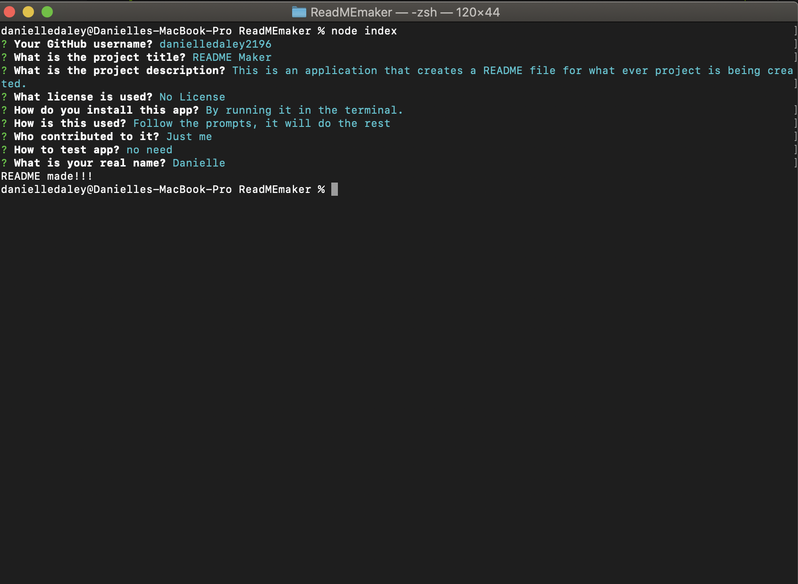

# READMe Maker
Made by Danielle Daley

## Description
Using node in the terminal, a ReadMe can be made by just filling out the questions. This uses two packages, iquirer and axios. Inquirer asks the questions, and axios grabs what's needed from Github. Then a READMe file is created, the informationis added if there is not one already there. Or a whole new file is created.

## Links
[GitHub](https://github.com/danielledaley2196/ReadMEmaker)
 
[Application Site] (https://danielledaley2196.github.io/ReadMEmaker/)

## Images

            